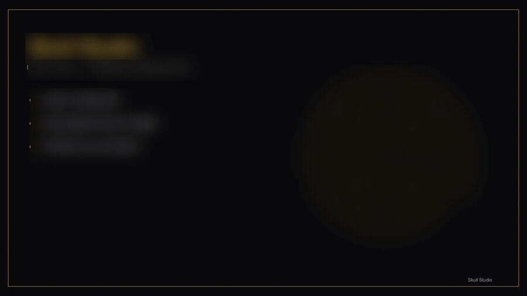
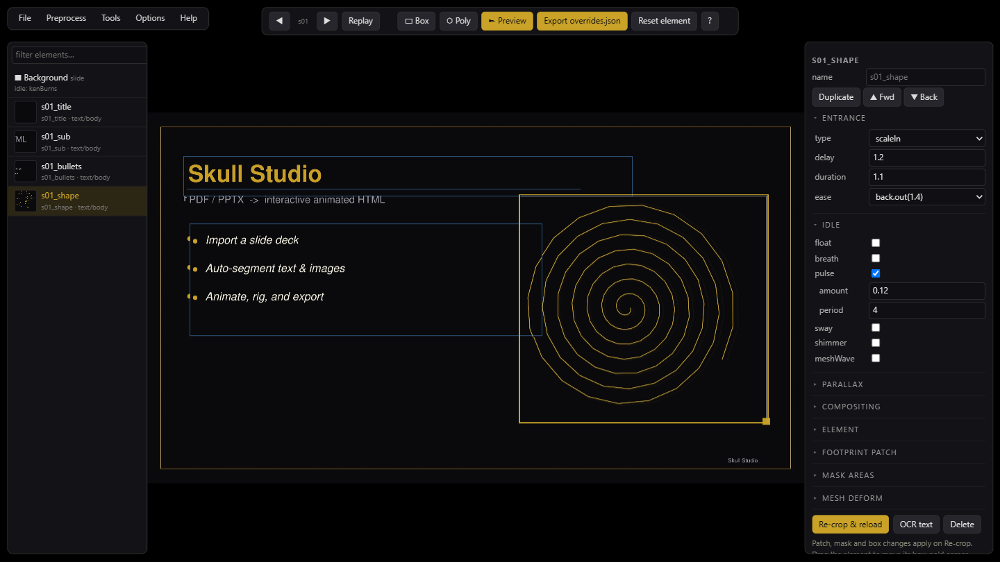

<div align="center">

# 💀 Skull Studio

**Turn PDF / PowerPoint slide decks into interactive, animated HTML** — with a
browser-based editor, mesh & 2D-bone rigging (Rive-style, but free for commercial
use), and export back to PowerPoint or self-contained video/GIF slideshows.

[Quick start](#-quick-start) · [Features](#-feature-tour) · [Exports](#-export-formats) ·
[Usage guide](docs/USAGE.md) · [Architecture](docs/ARCHITECTURE.md) · [Troubleshooting](docs/TROUBLESHOOTING.md)

<br>



<sub><i>Staggered entrances on the bundled sample deck — elements lift off a cleaned background and animate into place.</i></sub>

<br><br>



<sub><i>The in-browser editor: element list with thumbnails, the live PixiJS canvas, and the per-element inspector (entrance, idle, rig, blend, parallax).</i></sub>

</div>

> [!WARNING]
> **Vibe-coded, provided as-is.** This project was built rapidly and iteratively
> with heavy AI assistance ("vibe coding"). It works and is fairly well tested,
> but it has **not** had a formal security or production audit. Treat it as a
> capable hobby/creative tool: read the code, run it on a trusted local machine,
> and review before relying on it for anything important. **No warranty of any
> kind.** See [`SECURITY.md`](SECURITY.md).

---

## Table of contents

- [What is this?](#-what-is-this)
- [Why it exists](#-why-it-exists)
- [Quick start](#-quick-start)
- [Requirements](#-requirements)
- [Your first deck (walkthrough)](#-your-first-deck-walkthrough)
- [Feature tour](#-feature-tour)
- [Export formats](#-export-formats)
- [Command-line / headless use](#-command-line--headless-use)
- [Keyboard shortcuts](#-keyboard-shortcuts)
- [Project layout](#-project-layout)
- [How it works](#-how-it-works)
- [Troubleshooting](#-troubleshooting) · [FAQ](#-faq)
- [Contributing](#-contributing) · [Security](#-security) · [License](#-license)

---

## 🎯 What is this?

Skull Studio takes a finished slide deck (a **`.pdf`** or **`.pptx`**) and turns it
into a **living, animated web page** you can present, share, or embed — and it does
it without you hand-coding any animation. It:

1. **Imports** the deck: renders each slide, detects text and images (OCR + shape
   geometry), and splits them into independently-animatable elements. Large
   pictures that fill a slide become the **background**; everything else becomes a
   movable, animatable **element**.
2. Gives you a **browser editor** (PixiJS + GSAP) to choreograph entrances, idle
   loops, parallax, blend modes, and even **mesh / 2D-bone deformation** (think
   puppet-warp: a breathing chest, a swaying flag, a flexing arm).
3. **Exports** to several formats: a single self-contained **HTML** file, an
   **editable PowerPoint**, or a no-WebGL **"baked" HTML** slideshow where the
   motion is pre-rendered to looping video/GIF.

Everything runs **locally** — your slides never leave your machine.

## 💡 Why it exists

Tools like Rive make gorgeous rigged 2D animation but aren't free for commercial
use. PowerPoint can't do mesh deformation. Hand-animating a deck in code is slow.
Skull Studio stitches together free, open tools (PixiJS, GSAP, PyMuPDF, MinerU,
LibreOffice, ffmpeg) into one pipeline + editor so you can take an existing deck
and make it *move* — then ship it as a web page, a PowerPoint, or a video-backed
slideshow, whichever the audience needs.

## 🚀 Quick start

```bash
git clone https://github.com/TriasJ/skull-studio.git
cd skull-studio
python install.py        # checks tools, installs the package, vendors PixiJS/GSAP
skull-studio             # launches the editor in your browser
```

**Prefer to double-click?** Use a wrapper in [`launchers/`](launchers/) —
`Skull Studio.cmd` (Windows), `Skull Studio.command` (macOS), `skull-studio.sh`
(Linux). They call the cross-platform `python launch.py`, which runs the app **in
place without any install** (and fetches the browser libs on first run).

On the **Studio home page** that opens, import the included **`sample/demo.pdf`**
to go from import → edit → export in a couple of minutes.

> Prefer [uv](https://docs.astral.sh/uv/)? `uv run install.py` and
> `uv run skull-studio` work too, and `uv` makes the optional MinerU install
> cleaner.

## 📦 Requirements

| Requirement | Required? | What it's for | Install |
|---|---|---|---|
| **Python ≥ 3.10** | ✅ yes | the pipeline + local server | [python.org](https://www.python.org/) |
| **Node.js ≥ 18** | ✅ yes | builds the HTML output (uses built-in `fetch`) | [nodejs.org](https://nodejs.org/) · `winget install OpenJS.NodeJS` · `brew install node` · `apt install nodejs` |
| **ffmpeg** | ⬜ optional | bake idle/rig motion into mp4 / GIF | `winget install Gyan.FFmpeg` · `brew install ffmpeg` · `apt install ffmpeg` |
| **LibreOffice** | ⬜ optional | render `.pptx` slides on import | `winget install TheDocumentFoundation.LibreOffice` · `brew install --cask libreoffice` · `apt install libreoffice` |
| **MinerU** | ⬜ optional (heavy, ~GB) | OCR to recover text baked into slide images | `uv tool install "mineru[core]"` |

**Python packages** (installed automatically by `install.py` / `pip install -e .`):
PyMuPDF, Pillow, NumPy, OpenCV, jsonschema, python-pptx, RapidOCR. The browser
runtime bundles **PixiJS** (MIT) and **GSAP** (free for commercial use), fetched
during install.

**What works without the optionals:**

- No **ffmpeg** → everything except video/GIF baking.
- No **LibreOffice** → PDF import works; PPTX import does not.
- No **MinerU** → import with `--skip-mineru` (you get backgrounds, no recovered
  text — fine for decks where you'll add elements by hand, or PPTX with real text
  boxes). Decks whose text is *baked into images* need MinerU to recover it.

## 🧭 Your first deck (walkthrough)

1. **Launch:** `skull-studio`. Your browser opens the Studio home page.
2. **Import:** under *Import*, click **Import** next to `sample/demo.pdf` (or paste
   a path to your own `.pdf`/`.pptx`). The first pass renders the slides, detects
   elements, auto-assigns gentle animations, and crops each element. *(First PPTX
   import also downloads MinerU's OCR models — one-time, a few minutes.)*
3. **Edit:** click **open the editor**. Use the left list to pick an element, the
   right inspector to tune its **Entrance**, **Idle**, **Parallax**, and
   **Compositing**. Hit **Replay** to preview the slide.
4. **Rig (optional):** select an image element → **Mesh deform** → pick a *Quick
   motion* preset (Breathe, Sway, Pendulum…) or place pins yourself and keyframe a
   loop.
5. **Preview:** **File → Preview** builds and opens the finished presentation.
6. **Export:** **File → Export HTML / Export PPTX / Export baked HTML**, choosing a
   save location with the **Browse** button.

Edits autosave to the project. You can re-open `skull-studio` anytime and keep
going.

## ✨ Feature tour

### Import & segmentation
- **PDF and PPTX** input. PPTX uses LibreOffice to render slides plus python-pptx
  for exact shape geometry and real text frames; PDF uses PyMuPDF.
- **MinerU OCR** recovers text that's baked into slide images (common in
  image-exported decks) so it becomes editable text.
- **Large pictures → backgrounds**, smaller pictures/shapes → elements, text → text
  elements. You can fix any mis-detection in the editor.

### The editor
- **Element list** with **thumbnails**, a **filter box**, **rename**, **duplicate**
  (keeps animations/rig), and **z-order** (bring forward / send back).
- **Inspector** per element: Entrance · Idle · Parallax · Compositing (blend +
  opacity) · Element (type, z, detection box) · Footprint patch · Mask areas ·
  Mesh deform. Collapsible sections remember their state.
- **Background** entry per slide for slide-level idle (e.g. slow Ken-Burns zoom).
- **Draw tools:** **▭ Box** and **⬡ Polygon** to create new elements; polygons
  become true alpha-masked cutouts.
- **Region OCR**, **deck options** (transition, image quality), **Help** with a
  shortcut cheat-sheet.

### Animation vocabulary
- **Entrances:** fade, fadeUp/Down/Left/Right, scaleIn, maskReveal, blurIn, drawOn,
  staggerText — with delay / duration / easing.
- **Idle loops:** float, breath, pulse, sway, shimmer, meshWave; Ken-Burns for
  backgrounds.
- **Parallax:** per-element mouse-depth.
- **Compositing:** 13 blend modes (add, screen, multiply, overlay, …) + opacity.

### Mesh & 2D-bone rigging (the headline feature)
- **Quick-motion presets** (Breathe, Sway, Float, Pendulum, Wave) build a rig +
  looping animation in one click.
- **Pins** (puppet-warp): gold pins drive motion, gray pins anchor. **Shift+click**
  a pin for a **child bone** (chains follow their parent), **Alt+drag** to rotate.
- Two modes: **① Setup pins** (place/move) and **② Animate** (scrub the timeline,
  drag a pin to keyframe; the first keyframe auto-seeds rest keys so it loops home).
- A real **timeline**: labeled ruler, per-pin rows, draggable playhead and
  keyframes, right-click to delete.

### 3D models (PowerPoint → three.js, round-trip)
- Decks with **Insert → 3D Models** import automatically: each model becomes a
  `model3d` element. Works immediately via its 2D preview; renders **live in 3D**
  (three.js) when available, composited right into the 2D scene.
- Baked glTF **animations play**; add **auto-rotate** and tune the **camera** in
  the inspector. three.js ships **inline** (one file) or as a **vendor folder**,
  your choice at export, and only for decks that actually contain 3D.
- **Round-trips back to PowerPoint** as real 3D (with a 2D fallback for other apps).

### Masking, patches & censoring
- **Polygon cutouts** and FineReader-style **+/− Box / +/− Poly** boolean mask
  editing.
- **Footprint patch** (sampled fill colour or blurred backdrop) so an element can
  animate away without leaving a hole.
- **Hide (censor)** — cover a logo or unwanted text with its patch.

## 📤 Export formats

| Export | What you get | Best for |
|---|---|---|
| **HTML** | one self-contained `.html` (PixiJS+GSAP+assets inlined), live-animated; optional bundled editor (press **E**) | sharing a link/file, embedding, presenting |
| **PPTX** | editable PowerPoint: OCR text → real text boxes, entrances → Fade, idle/rig motion → looping **mp4/GIF** clips, **3D models round-tripped** as real 3D | handing off to PowerPoint users |
| **Baked HTML** | no-WebGL DOM slideshow; animated elements are `<video>`/`` | maximum compatibility / low-power devices |

**PPTX options:** PNG or JPEG images (JPEG is ~7× smaller), font-size override,
animate entrances (→ PowerPoint Fade), bake **animated assets** to mp4 or GIF, and
an optional patch layer. **Prefer mp4** over GIF — GIF is universal but huge for
photographic content.

**Baked HTML options:** mp4/GIF, fps, and **base64** (single portable file) or
**folder** (small HTML + an assets dir).

> 📌 **PPTX gotcha we handle for you:** PowerPoint allows exactly one animation
> timing block per slide. Skull Studio merges all entrance + media-play timing into
> a single block — multiple blocks are the classic cause of PowerPoint's "repair"
> prompt.

## 🖥 Command-line / headless use

Run the whole pipeline without the editor:

```bash
python -m skull_studio.pipeline sample/demo.pdf
#   --skip-mineru   backgrounds only (no OCR)
#   --no-choreo     don't auto-assign animations
#   --bg-quality N  background WebP quality (default 78)
#   --out PATH      output html path
#   --no-build      stop before building HTML
```

Individual stages are modules too: `python -m skull_studio.export_pptx`,
`skull_studio.render_clips`, `skull_studio.build_baked` (via `node`), etc. See
[docs/USAGE.md](docs/USAGE.md).

## ⌨️ Keyboard shortcuts

| Key | Action |
|---|---|
| **E** | toggle the editor overlay |
| **← → / Space / click / swipe** | navigate slides |
| **Esc** | close editor / cancel a tool |
| **Ctrl+S** | save (Studio) |
| **Ctrl+Del** | delete the selected element |
| **Del** | delete the selected rig pin / keyframe |
| **Shift+click** (rig) | add a child bone to the selected pin |
| **Alt+drag** (rig) | rotate a pin |

## 🗂 Project layout

```
skull_studio/      Python pipeline + Node build scripts + the local server
  studio.py          the Skull Studio app (HTTP server + editor host)
  pipeline.py        one-command import → build
  extract*.py        PDF / PPTX rendering + OCR + shape detection
  crop_and_patch.py  element crops + fill/blur footprint patches
  export_pptx.py     editable PowerPoint export
  render_clips.py    bake idle/rig motion to mp4/GIF (numpy + OpenCV + ffmpeg)
  build*.mjs         HTML / baked-HTML builders (Node)
  make_sample.py     generate sample/demo.pdf
runtime/
  src/*.js           editor + player runtime (plain modules, 00–66)
  template.html      HTML shell; vendor/  vendored PixiJS + GSAP (fetched)
work/                intermediate artifacts (manifest.json, crops, clips) — gitignored
dist/                built deliverables — gitignored
sample/demo.pdf      a small original deck to try
docs/                USAGE, ARCHITECTURE, TROUBLESHOOTING
```

## 🔧 How it works

Everything revolves around **`work/manifest.json`** — a single JSON document
describing slides, elements, bounding boxes, animations, and rigs. The importer
writes it, the editor edits it live, and every exporter reads it. The browser
runtime is plain IIFE modules concatenated in numeric order (`00`–`90`); the editor
modules (`60`–`66`) are stripped from viewer builds. Full details — manifest
schema, the "one-writer" scene graph, rig skinning math, the PPTX timing rule — are
in **[docs/ARCHITECTURE.md](docs/ARCHITECTURE.md)**.

## 🩹 Troubleshooting

A few common ones (full list in [docs/TROUBLESHOOTING.md](docs/TROUBLESHOOTING.md)):

- **`skull-studio` not found** → re-open your terminal, or run `uv run skull-studio`
  / `python -m skull_studio.studio`.
- **PPTX import does nothing** → install LibreOffice (and make sure `soffice` is on
  PATH).
- **Imported deck has no text, only backgrounds** → install MinerU, or the deck's
  text is baked into images and you ran `--skip-mineru`.
- **PowerPoint asks to "repair"** → re-export with the current version (the
  one-timing-per-slide fix); if it persists, prefer the **GIF** clip export.
- **"Different server" / wrong port** → only run one `skull-studio` at a time; it
  prints the exact URL.

## ❓ FAQ

- **Does my deck leave my computer?** No. Everything runs on `localhost`; exports
  are local files. (PixiJS/GSAP are downloaded once at install.)
- **Can I edit a shipped HTML file later?** Yes — build the "with embedded editor"
  variant and press **E**, or keep the project and re-export.
- **mp4 or GIF for PPTX?** mp4 (much smaller, smooth). GIF only for compatibility.
- **Is the rigging really like Rive?** It's a pragmatic puppet-warp (pins/bones +
  keyframes + CPU skinning), not a full Rive feature set — but it's free and
  exports to video.

## 🤝 Contributing

Issues and PRs welcome — see [`CONTRIBUTING.md`](CONTRIBUTING.md). This is a
hobby/creative project with no SLA; be kind and patient.

## 🔒 Security

A **local, unauthenticated** tool — read [`SECURITY.md`](SECURITY.md) before
exposing it beyond `localhost` or importing untrusted decks.

## 📄 License

**MIT** — see [`LICENSE`](LICENSE). Bundled/optional third-party components
(PixiJS, GSAP, PyMuPDF, MinerU, LibreOffice, ffmpeg) and their licenses are listed
in [`THIRD_PARTY.md`](THIRD_PARTY.md). Note MinerU is AGPL and PyMuPDF is
AGPL/commercial — review them if you redistribute a product built on this.

## 🙏 Acknowledgements

Built on the shoulders of [PixiJS](https://pixijs.com/), [GSAP](https://gsap.com/),
[PyMuPDF](https://pymupdf.readthedocs.io/), [MinerU](https://github.com/opendatalab/MinerU),
[RapidOCR](https://github.com/RapidAI/RapidOCR), [LibreOffice](https://www.libreoffice.org/),
and [ffmpeg](https://ffmpeg.org/) — and a lot of iterative AI pair-programming.
